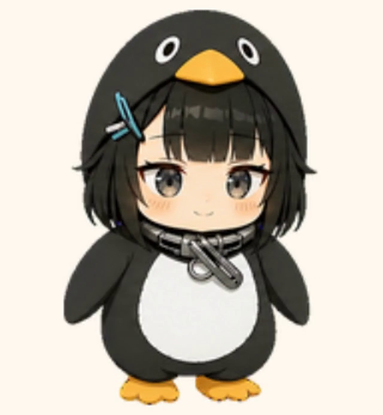

# GuguPet for Codex · 咕嘎独立桌宠

**简体中文** | [English](README.en.md) | [日本語](README.ja.md)

`GuguPet for Codex` 是一个原生 Windows WPF 桌宠播放器，使用现有 Codex Pet v2 咕嘎图集，不修改 Codex 或原始 Pet 文件。


## 演示

[](docs/media/gugupet-for-codex-demo.mp4)

上图可点击播放 16 秒真实运行录像。录像由隔离的演示模式直接捕获咕嘎窗口，只包含咕嘎和纯色背景；不读取 Codex 会话，也不录制桌面、控制台或其他窗口。

> 非官方同人项目，与 OpenAI、Codex、哔哩哔哩及角色原作者没有隶属或背书关系。

## 下载与运行

从仓库的 **Releases** 页面下载 `GuguPet-Windows-x64-*.zip`，解压后运行 `GuguPet.exe`。当前便携包为自包含 Windows x64 构建，不要求用户另外安装 .NET。

当前发布包尚未进行 Authenticode 数字签名。首次运行可能出现 Windows SmartScreen 提示；请从本仓库下载并核对 Release 中公布的 SHA-256。

## 内置行为

- 待机动画
- 悬停跳跃
- 左键拖动时向左/向右奔跑
- 初次启动挥手
- 启动咕嘎程序时播放约 5 秒的猫眼登场：等待、推箱、爬上行李箱、贴近镜头并眨眼；可在控制台关闭或随时预览，按 Esc 跳过
- 默认启动后只显示咕嘎，不弹出控制台；可在“咕嘎登场动画”设置中恢复随启动显示控制台
- 16方向鼠标注视
- 鼠标注视使用窗口本地坐标和逐显示器 DPI 换算，支持不同缩放比例与多显示器
- `running`、`waiting`、`failed`、`review` 等 Codex 状态动画
- 鼠标注视为低优先级待机反应，停止移动后按可调时间自动恢复待机
- 默认只读监听 `%USERPROFILE%\.codex\sessions`，自动响应 Codex 开始、完成和错误事件
- 从公开的 `agent_message` 事件提取安全进度摘要，在咕嘎旁显示临时气泡
- 控制台显示最近 8 个 Codex 任务的状态、标题与公开进度，不读取或展示内部推理
- 点击实时进度气泡会恢复并唤起 Codex 主窗口；Codex 未运行时尝试从开始菜单启动
- 右键打开即时控制面板
- 尺寸、透明度、速度、置顶和减少动态效果调节
- 扩展动作包含弹吉他、吃饼干、三种睡姿、需要输入、喝水、伸懒腰、坐着思考，以及专用摸头/护肚反应
- 可在控制台即时预览扩展动作，也可设置待机随机播放间隔
- 可在桌面工作区内随机选择目标并走动，支持开关与移动速度调节
- 工作中按托腮 50%、线圈眼 30%、星星眼 20% 加权随机切换，思考素材逐帧保持相同体积和位置
- 需要输入时在挥手与“举鳍—探头—轻敲—等待”之间随机；完成时随机星星眼、跳跃或吃饼干
- 长时间运行会短暂托腮、喝水或伸懒腰，然后继续思考；收到新进度会先抬头回应再恢复
- 单击头部摸头、双击肚子触发护肚反应；拖动松手后有衰减惯性
- 可把控制台里的饼干拖到咕嘎身上；鼠标靠近脚边时咕嘎低头观察
- 长时间无操作会随机侧睡、趴窝或仰睡；快速鼠标追逐默认关闭并可单独开启
- 可选屏幕边缘动作：走到边缘、探头、趴窝，再爬回工作区
- 文件拖到咕嘎身上会复制为文件投递数据并打开 Codex，气泡提示在输入框粘贴
- 状态气泡支持需要输入/失败处理按钮、完成摘要，以及最多 8 个任务的优先级排序和左右切换
- 咕嘎右键菜单在“新建 Codex 任务”下方显示最近 3 个主任务及状态；点击可返回 Codex，当前公开接口无法精确深链到某个任务

## 状态桥接

控制台中的“自动跟随 Codex 工作状态”默认开启。Codex 开始任务时切换为 `running`，请求输入时切换为 `waiting`，完成后短暂切换为 `review`，明确错误切换为 `failed`。该功能只读访问会话日志，不修改 Codex 数据，也不读取或展示内部推理。

“系统集成”中的“随 Codex 启动咕嘎（无需 Hook）”默认关闭。用户主动启用后，程序注册普通的用户级 Windows 启动项，并由隐藏监听模式等待 `ChatGPT.exe`；检测到 Codex 桌面端启动时再显示咕嘎。取消勾选会删除启动项并停止监听器，不需要修改 `hooks.json` 或进入 Codex CLI 信任命令。

## 语言包

便携版在第一次启动时读取 Windows 的界面语言（`.NET CurrentUICulture`），依次匹配完整区域代码和语言代码。当前内置：

- `Locales/zh-CN.json`：简体中文
- `Locales/en-US.json`：English
- `Locales/ja-JP.json`：日本語

未匹配到的语言回退到英文。用户可以在“系统集成 → 语言”中覆盖自动选择，重启咕嘎后生效。

新增语言不需要修改程序：复制任一 JSON 文件，修改 `culture`、`displayName` 和 `strings`，文件名建议使用标准区域代码（例如 `ko-KR.json`）。非中文语言包缺少的键会回退到英文，再回退到程序中的中文原文；单个语言包上限为 2 MB，格式错误的文件会被安全忽略。

需要由其他程序主动控制时，也可以编辑 `%LOCALAPPDATA%\GuguPet\bridge-state.json`：

```json
{
  "state": "running",
  "message": "正在处理任务"
}
```

支持的状态：`idle`、`running-right`、`running-left`、`waving`、`jumping`、`failed`、`waiting`、`running`、`review`。

文件保存后会自动热更新。任何本地脚本都可以通过写入这个文件控制桌宠。

## 开发运行

```powershell
dotnet run --project .\GuguPet.csproj
```

维护者可用 `--demo-capture` 启动只展示咕嘎动作的隔离录制模式。该模式使用独立实例、纯色窗口背景，并禁用会话监听、状态桥、随机移动与鼠标注视；它不面向普通用户启动流程。

## 发布

```powershell
dotnet publish .\GuguPet.csproj -c Release -r win-x64 --self-contained true -p:PublishSingleFile=true
```

## 隐私、安全与许可

- [隐私说明](PRIVACY.md)
- [安全策略](SECURITY.md)
- [卸载说明](UNINSTALL.md)
- [Code signing policy](CODE_SIGNING_POLICY.md)
- 源代码与项目内 AI 生成美术素材均使用 [MIT License](LICENSE)
- 素材来源和第三方权利边界参见 [Asset notice](ASSET_NOTICE.md)

Free code signing provided by [SignPath.io](https://signpath.io/), certificate by [SignPath Foundation](https://signpath.org/).
